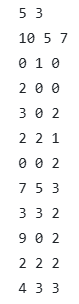
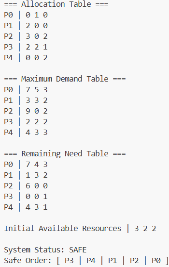

# **Banker’s Algorithm – Programming Assignment 2**

## **Overview**
This program implements the Banker’s Algorithm for deadlock avoidance.  
It reads system state information from an input file, computes the Allocation, Max, Need, and Available matrices, and determines whether the system is in a safe state. If the state is safe, the program prints the safe sequence. If not, the terminal will display so.


## **How to Compile (Linux / GitHub Codespaces)**

```
g++ -std=c++17 banker.cpp -o banker
```


## **How to Run**

```bash
./banker input.txt
```

## **Input**




## **Output**




## **Conclusion**

The data given to us (input.txt) was indeed in safe state, and was rightfully so the safe sequence was displayed in the output.


